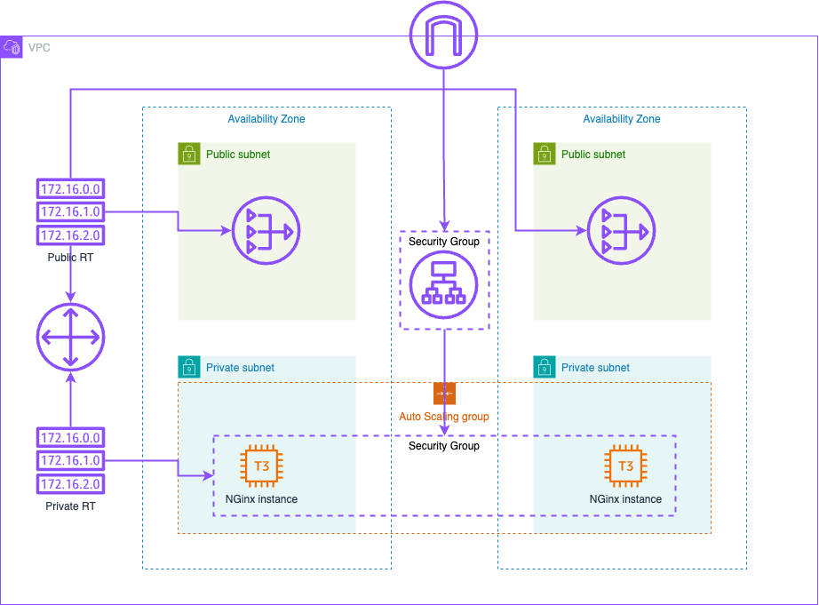

# Basic Infra TF/AWS

## Goal

Run a simple infrastructure on AWS using Terraform and reach NGinx servers through a load balancer.

  

- Purple: Networking module
- Orange: Computing module
- The rest: VPC module

## Notes

Unlike the infra that was gave to me, I took the liberty to change the architecture a bit. I added a second NAT Gateway in the second public subnet to have a more resilient architecture (this isn't required in a such infra, but in a more involved one that could result in cross-AZ data transfer expenses, or if the first AZ goes down, a unique NAT Gateway will fall with it which is not really convenient).
